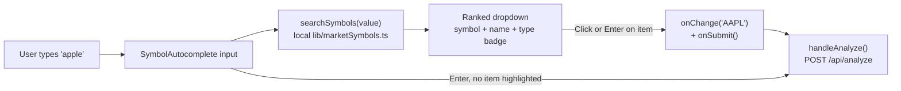

## Goal

Replace the plain `<input>` in the "Enter Market to Analyze" card with a searchable typeahead that suggests matching tickers and shows a colored type badge for each match.

## Files to change

- **NEW** [frontend/sentilyze/lib/marketSymbols.ts](frontend/sentilyze/lib/marketSymbols.ts) — curated symbol dataset + ranked search helper.
- **NEW** [frontend/sentilyze/components/analysis/SymbolAutocomplete.tsx](frontend/sentilyze/components/analysis/SymbolAutocomplete.tsx) — controlled input + suggestion dropdown with full keyboard support.
- **EDIT** [frontend/sentilyze/app/Analysis/page.tsx](frontend/sentilyze/app/Analysis/page.tsx) — swap the `<input>` at lines 339–347 for `<SymbolAutocomplete />`. No backend changes needed; `/api/analyze` already accepts any string symbol.

## 1. Symbol dataset — `lib/marketSymbols.ts`

Plain TypeScript module exporting a typed array (no runtime cost beyond a single import) plus a search function. Approx. sizes:

- **Stocks (~150):** S&P 500 leaders + popular international tickers (AAPL, MSFT, NVDA, TSLA, AMZN, GOOGL, META, NFLX, AMD, INTC, JPM, BAC, V, MA, KO, PEP, NKE, DIS, BA, XOM, …).
- **Crypto (~40):** BTC, ETH, SOL, BNB, XRP, ADA, DOGE, AVAX, DOT, MATIC, LINK, LTC, BCH, TRX, SHIB, …
- **Forex (~20):** EUR/USD, GBP/USD, USD/JPY, USD/CHF, AUD/USD, USD/CAD, NZD/USD plus crosses (EUR/GBP, EUR/JPY, GBP/JPY, …).

Shape:

```ts
export type MarketType = "Stock" | "Crypto" | "Forex";

export interface MarketSymbol {
  symbol: string;     // canonical ticker, e.g. "AAPL", "BTC", "EUR/USD"
  name: string;       // e.g. "Apple Inc.", "Bitcoin", "Euro / US Dollar"
  type: MarketType;
  aliases?: string[]; // optional, e.g. ["XBT"] for Bitcoin
}

export function searchSymbols(query: string, limit = 8): MarketSymbol[];
```

Ranking inside `searchSymbols` (case-insensitive, returns at most `limit`):

1. Exact symbol match.
2. Symbol `startsWith(query)`.
3. Name `startsWith(query)` (or any alias).
4. Name `includes(query)` (substring).

Returns `[]` for empty/very short input under 1 char so the dropdown stays hidden.

## 2. Autocomplete component — `components/analysis/SymbolAutocomplete.tsx`

Client component (`"use client"`). Props:

```ts
interface Props {
  value: string;
  onChange: (v: string) => void;
  onSubmit: () => void;          // Enter when no suggestion is highlighted
  disabled?: boolean;
  placeholder?: string;
}
```

Behavior:

- Internal state: `open: boolean`, `activeIndex: number`.
- `suggestions = useMemo(() => searchSymbols(value), [value])` — pure, instant, no debounce needed since it's in-memory.
- Dropdown opens on focus when there are results; closes on blur (with a small `setTimeout` so click events on items still register), Escape, or outside click (`useRef` + `mousedown` listener on `document`).
- Keyboard:
  - `ArrowDown` / `ArrowUp` move `activeIndex` (wraps).
  - `Enter` → if `activeIndex >= 0`, pick that suggestion (set value to its `symbol`, close dropdown, call `onSubmit`); otherwise call `onSubmit` directly (preserves current behavior of "Enter to analyze").
  - `Escape` closes the dropdown.
- Mouse: clicking a row picks that suggestion.
- Picking a suggestion: `onChange(symbol)` then close dropdown and trigger `onSubmit` so the analysis kicks off immediately (matches typical finance UX). I'll wire this so the existing `disabled` / loading checks in `handleAnalyze` still apply.

Row rendering (Tailwind, matches existing dark theme):

- Bold symbol on the left (`text-white font-semibold`).
- Name in `text-gray-400 text-sm`.
- Right-aligned type badge with the project's existing color language:
  - `Stock` → cyan (`text-cyan-400 bg-cyan-500/10 border-cyan-500/30`)
  - `Crypto` → amber (`text-amber-400 bg-amber-500/10 border-amber-500/30`)
  - `Forex` → purple (`text-purple-400 bg-purple-500/10 border-purple-500/30`)
- Active row: `bg-white/10`. Hover updates `activeIndex` for consistency with keyboard.

Dropdown container: `absolute` under the input, `z-20`, `bg-zinc-950 border border-white/10 rounded-lg shadow-lg max-h-72 overflow-y-auto`. Wrapping `<div className="relative flex-1">` so it positions correctly inside the existing flex row.

## 3. Wiring into the Analysis page

In [frontend/sentilyze/app/Analysis/page.tsx](frontend/sentilyze/app/Analysis/page.tsx):

- Import the new component near the other imports.
- Replace the `<input>` block at lines 339–347 with:

```tsx
<SymbolAutocomplete
  value={marketInput}
  onChange={setMarketInput}
  onSubmit={() => { if (!loading) handleAnalyze(); }}
  disabled={loading}
  placeholder="Search symbol or name (e.g., apple, bitcoin, EUR/USD)"
/>
```

- Keep the existing `<button>` "Start Analyze" beside it; the flex layout is unchanged because the component renders its own `relative flex-1` wrapper.
- No other state changes needed; `marketInput` remains the single source of truth that `handleAnalyze` reads.

## Flow



## Out of scope

- No new API routes or env vars.
- No changes to `/api/analyze`, Supabase schema, or the recent-analyses panel.
- No fuzzy matching library — simple ranked substring search is enough for ~200 entries and keeps bundle size flat.